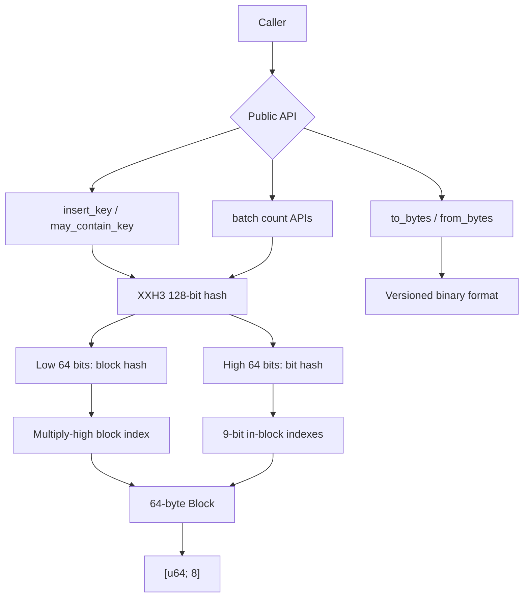
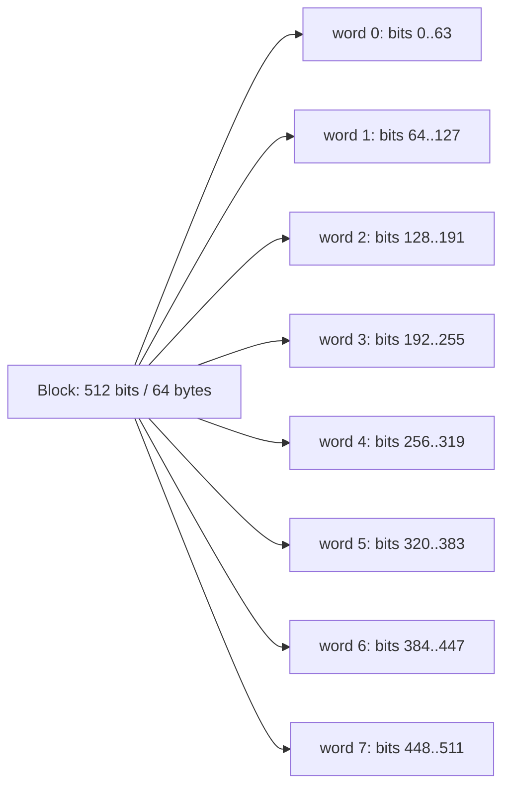
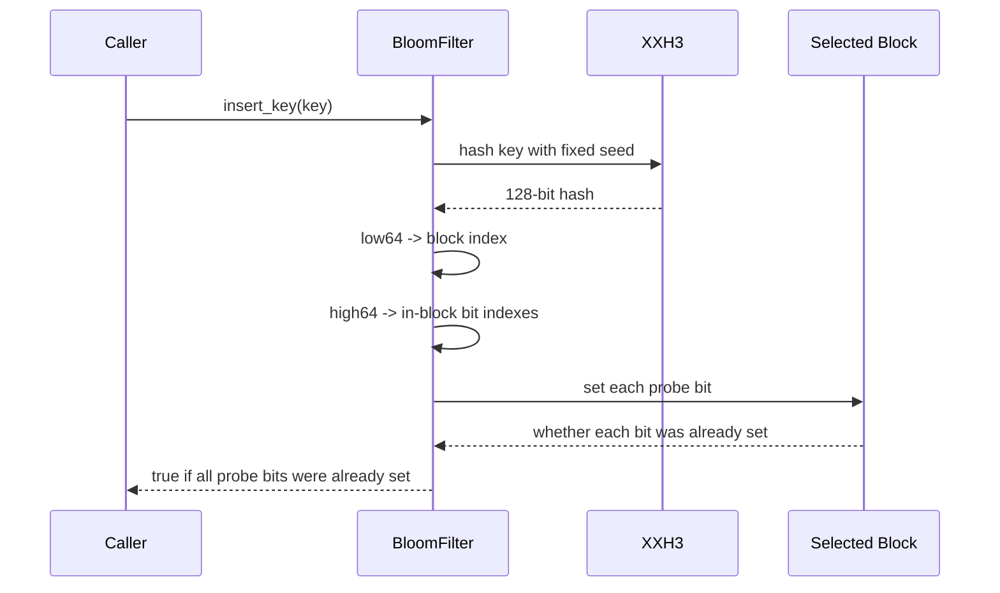
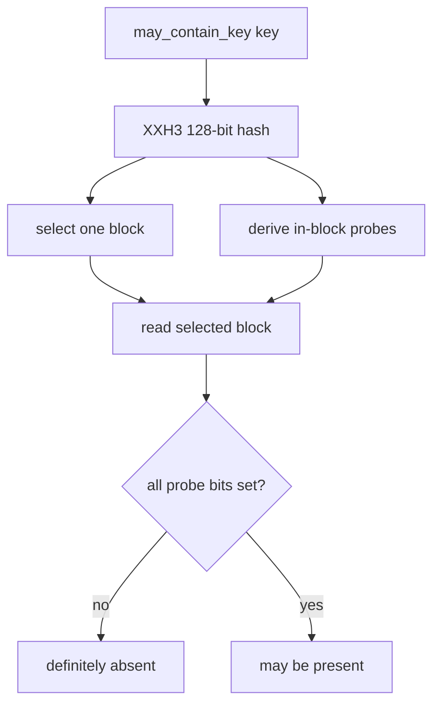
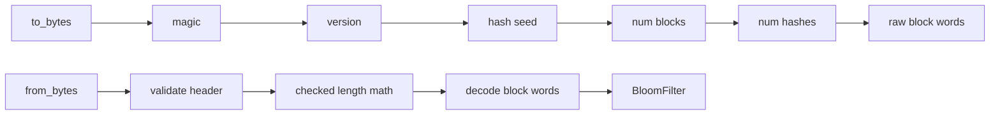
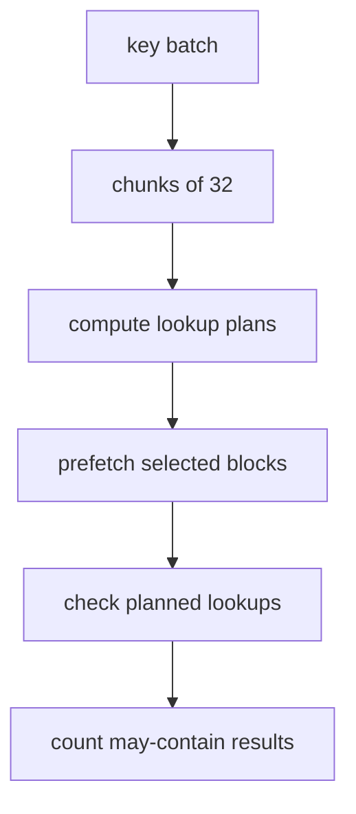
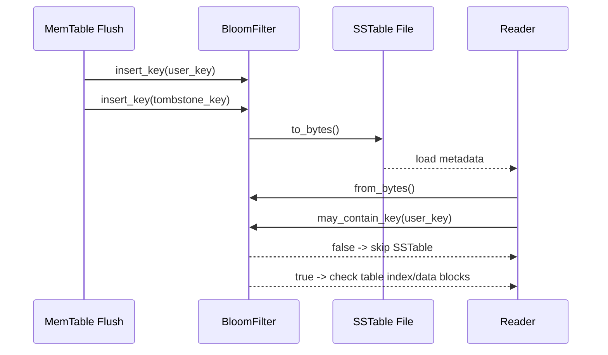

# Bloom Bloom

Bloom Bloom is a compact Rust implementation of a deterministic, cache-conscious block Bloom filter.

It answers one question quickly:

> Can this byte key possibly exist?

The answer is intentionally asymmetric:

- `false`: the key is definitely absent from the completed filter state.
- `true`: the key may be present, or it may be a false positive.

This makes Bloom Bloom useful as a fast pre-check before expensive exact work, such as reading an SSTable block from disk, checking a cache shard, or probing a larger index.

## Current Design

Bloom Bloom started as a conventional Bloom filter with generic `T: Hash` values, a packed `Vec<u64>` bit vector, and an atomic variant for concurrent mutation. The current implementation has been redesigned around storage-engine use cases:

- deterministic byte-key API: `&[u8]`
- `xxh3_128_with_seed` hashing
- fixed hash seed stored in the serialized format
- 512-bit block layout with 64-byte alignment
- one block access per key
- block-aware false-positive-rate sizing
- manual serialization and checked deserialization
- normal single-key lookup API
- batch count APIs
- optional x86_64 software prefetch
- branchless batch lookup path for missing-heavy workloads

The core type is now:

```rust
pub struct BloomFilter {
    blocks: Vec<Block>,
    num_hashes: u32,
}
```

There is no production `AtomicBloomFilter` in the current design. For SSTables and similar immutable structures, the expected lifecycle is:

```text
build with &mut BloomFilter
serialize to disk
load later
share read-only through &BloomFilter
```

Immutable reads are already thread-safe in Rust as long as callers share `&BloomFilter` or `Arc<BloomFilter>`.

## Architecture



The filter is split into blocks. Each key selects exactly one block, and all of its Bloom probes are checked or set inside that block.

This is the major change from a classic global Bloom filter, where each probe can land anywhere in one large bit array.

## Block Layout

Each block contains eight `u64` words:

```rust
const BLOCK_WORDS: usize = 8;
const WORD_BITS: usize = 64;
const BLOCK_BITS: usize = BLOCK_WORDS * WORD_BITS; // 512
```

The block type is aligned to 64 bytes:

```rust
#[repr(align(64))]
struct Block {
    words: [u64; 8],
}
```

Diagram:



Mapping a bit inside a block is simple:

```rust
let word_index = bit_index >> 6; // bit_index / 64
let bit_offset = bit_index & 63; // bit_index % 64
let mask = 1u64 << bit_offset;
```

## Hashing

Bloom Bloom hashes byte keys with:

```rust
xxh3_128_with_seed(key, BLOOM_HASH_SEED)
```

The 128-bit hash is split into two independent-looking halves:

```text
low 64 bits  -> choose the block
high 64 bits -> choose bit positions inside that block
```

This separation matters. Earlier versions used derived hashes over one global bit array. In the block layout, using the same hash bits for both block selection and in-block bit selection can create correlation and raise the false-positive rate.

Current lookup shape:

```mermaid
flowchart TD
    A[key bytes] --> B[XXH3 128-bit hash]
    B --> C[low 64 bits]
    B --> D[high 64 bits]
    C --> E[block_index = index(num_blocks, low64)]
    D --> F[extract 9-bit bit indexes]
    E --> G[selected 512-bit block]
    F --> G
```

## In-Block Probes

A block has 512 bits:

```text
512 = 2^9
```

So one in-block bit index needs 9 bits of entropy.

For the common `num_hashes == 7` case:

```text
7 * 9 = 63 bits
```

That fits inside the high 64-bit half of the XXH3 hash. Bloom Bloom has a manually unrolled fast path for this case:

```text
bits 0..8   -> probe 0
bits 9..17  -> probe 1
bits 18..26 -> probe 2
bits 27..35 -> probe 3
bits 36..44 -> probe 4
bits 45..53 -> probe 5
bits 54..62 -> probe 6
```

For fewer than seven probes, the filter consumes fewer 9-bit chunks. For more than seven probes, it re-mixes the high 64-bit state with a SplitMix-style mixer and continues producing indexes.

## Insert Flow



`insert_key` returns:

- `false`: at least one bit changed from `0` to `1`.
- `true`: all target bits were already set.

Because Bloom filters allow collisions, `true` means "probably already represented", not "this exact key was definitely inserted before."

## Lookup Flow



The normal single-key lookup path short-circuits on the first missing bit. This is simple and good for ordinary lookups.

The batch branchless path checks all seven bits and combines the results without short-circuiting. That can be faster for large missing-heavy batches because random early exits can be hard for the CPU branch predictor.

## Serialization Format

Bloom Bloom serializes to an explicit little-endian binary format:

```text
offset  size  field
0       8     magic: "BLMFILT1"
8       4     version: u32
12      8     hash seed: u64
20      8     num_blocks: u64
28      4     num_hashes: u32
32      ...   block words: num_blocks * 8 * u64
```



Deserialization checks:

- input length is at least the header length
- magic matches
- version is supported
- hash seed matches
- block count is nonzero
- hash count is between `1` and `MAX_HASHES`
- payload length arithmetic does not overflow
- byte length matches exactly

This makes the format suitable for SSTable metadata blocks and other persisted storage.

## Public API

### Constructing A Filter

```rust
use bloom_bloom::BloomFilter;

let mut filter = BloomFilter::with_false_positive_rate(100_000, 0.01);
```

Or use explicit sizing:

```rust
let filter = BloomFilter::with_num_bits(1_048_576, 7);
```

Or a config object:

```rust
use bloom_bloom::{BloomConfig, BloomFilter};

let config = BloomConfig {
    expected_items: 100_000,
    false_positive_rate: 0.01,
};

let filter = BloomFilter::from_config(config);
```

### Inserting Keys

```rust
let mut filter = BloomFilter::with_false_positive_rate(10_000, 0.01);

let was_probably_present = filter.insert_key(b"alice");
assert!(!was_probably_present);

filter.insert_str("bob");
```

The preferred API is byte-based:

```rust
insert_key(&mut self, key: &[u8])
```

This is intentional. Storage engines, network protocols, caches, and file formats all eventually operate on bytes. It also avoids unstable or version-dependent Rust `Hash` output.

### Checking Keys

```rust
assert!(filter.may_contain_key(b"alice"));

if !filter.may_contain_key(b"carol") {
    // definitely absent
}
```

`contains_key` and `contains_str` are also available as aliases, but `may_contain_key` better communicates Bloom-filter semantics.

### Batch Counting

For ergonomic batch counting:

```rust
let keys = vec![b"alice".to_vec(), b"bob".to_vec(), b"carol".to_vec()];
let count = filter.count_may_contain(&keys);
```

For a performance-oriented borrowed-slice path:

```rust
let key_refs = keys.iter().map(|key| key.as_slice()).collect::<Vec<_>>();

let count = filter.count_may_contain_keys_prefetch(&key_refs);
let branchless_count = filter.count_may_contain_keys_prefetch_branchless(&key_refs);
```

The prefetch methods are useful for large batch workloads. They process keys in stack-allocated chunks of 32 lookup plans, optionally prefetching blocks before checking them.



Hardware prefetch is behind a feature flag:

```bash
cargo run --release --features prefetch
```

Without the feature, the batch method still works and the prefetch call compiles to a no-op.

### Serialization

```rust
let bytes = filter.to_bytes();
let loaded = BloomFilter::from_bytes(&bytes)?;
```

This is the API you would use to write the filter into an SSTable footer or metadata block.

### Size And Probability Helpers

```rust
println!("blocks: {}", filter.num_blocks());
println!("bits: {}", filter.num_bits());
println!("hashes: {}", filter.num_hashes());
println!("payload bytes: {}", filter.byte_len());
println!("serialized bytes: {}", filter.serialized_len());

println!(
    "estimated fp rate: {:.4}",
    filter.expected_false_positive_rate(100_000)
);
```

Free helper functions are also exposed:

- `optimal_num_bits`
- `optimal_num_hashes`
- `expected_density`
- `expected_false_positive_rate`
- `expected_block_false_positive_rate`

## LSM / SSTable Usage

Bloom Bloom is especially suited for immutable table filters.



Important storage-engine notes:

- Hash the user key, not an internal key with a timestamp, unless your lookup path can reproduce that exact internal key.
- Insert tombstone keys into the filter. A tombstone is still an entry for that key.
- Build the filter completely before publishing the SSTable.
- Share the loaded filter immutably between readers.
- Keep `BLOOM_HASH_SEED` and the serialized format stable across database versions.

## Running The Project

Run tests:

```bash
cargo test
```

Run the benchmark/demo binary with the default `1_000_000` item workload:

```bash
RUSTFLAGS="-C target-cpu=native" cargo run --release
```

Run with a larger workload:

```bash
RUSTFLAGS="-C target-cpu=native" cargo run --release -- 5000000
```

Run with hardware prefetch enabled:

```bash
RUSTFLAGS="-C target-cpu=native" cargo run --release --features prefetch -- 5000000
```

The demo:

1. prepares present and missing byte keys,
2. builds the filter,
3. serializes and deserializes it,
4. compares normal lookup, batched lookup, and branchless batched lookup,
5. prints the measured false-positive rate.

## Performance Notes

The main performance choices are:

- `xxh3_128_with_seed` gives one deterministic 128-bit hash per key.
- The low hash half selects one 512-bit block.
- The high hash half selects bit positions inside that block.
- The common 7-probe case is manually unrolled.
- Bit positions inside a block are extracted with shifts and masks.
- Multiply-high range reduction avoids `%` for block selection.
- Batch lookup uses stack-allocated lookup plans instead of heap allocation.
- Optional prefetch can help when filters are large enough to miss cache.
- Branchless batch lookup can outperform short-circuit lookup for random missing-heavy workloads.

Single-key lookup and batch throughput measure different things. Batch numbers can look extremely small per key because Rayon spreads work across many CPU threads. That is throughput, not isolated single-key latency.

### Benchmark Snapshot

Example run on a 5,000,000-key workload:

```bash
RUSTFLAGS="-C target-cpu=native" cargo run --release --features prefetch -- 5000000
```

Configuration:

```text
expected items:      5,000,000
target fp rate:      0.01
num bits:            49,518,080
num hashes:          7
num blocks:          96,715
serialized bytes:    6,189,792
serialized MiB:      5.90
rayon threads:       16
prefetch feature:    true
estimated density:   0.5068
estimated fp rate:   0.0100
measured fp rate:    0.0101
```

Per-operation conversions below use:

```text
lookup ns/op = elapsed nanoseconds / 5,000,000 lookups
insert ns/op = elapsed nanoseconds / 5,000,000 inserts
key prep ns/key = elapsed nanoseconds / 10,000,000 prepared keys
```

The lookup numbers are parallel throughput across 16 Rayon threads, not isolated single-lookup latency.

| Operation | Total Time | Nanoseconds Per Operation | Notes |
| --- | ---: | ---: | --- |
| Key preparation | `75.373243 ms` | `7.54 ns/key` | Prepares 5M present keys and 5M missing keys |
| Build insert | `47.405010 ms` | `9.48 ns/insert` | Sequential construction of the immutable filter |
| Serialize + load | `4.031543 ms` | `0.81 ns/key amortized` | Full-filter serialization plus deserialization |
| Normal present lookup | `6.806991 ms` | `1.36 ns/lookup` | Parallel short-circuit lookup |
| Normal missing lookup | `9.252004 ms` | `1.85 ns/lookup` | Parallel short-circuit lookup; branch prediction can make misses slower |
| Batched present lookup | `4.326980 ms` | `0.87 ns/lookup` | Chunked batch lookup with planned probes |
| Batched missing lookup | `6.887766 ms` | `1.38 ns/lookup` | Chunked batch lookup with planned probes |
| Branchless present lookup | `4.716853 ms` | `0.94 ns/lookup` | Checks all seven probes without early exit |
| Branchless missing lookup | `4.580710 ms` | `0.92 ns/lookup` | Best path here for random missing-heavy batches |

The branchless missing result is faster than the normal missing result because it avoids unpredictable early-exit branches. A normal missing lookup often checks fewer Bloom bits, but the first missing bit appears at a random probe position, which can be expensive for the CPU branch predictor.

## Correctness Boundaries

Bloom Bloom guarantees:

- no false negatives for keys inserted into a completed filter state,
- deterministic behavior for the same serialized format and hash seed,
- checked decoding of serialized filters,
- configurable false-positive targets based on expected item count.

Bloom Bloom does not guarantee:

- exact membership,
- deletion of individual keys,
- listing inserted keys,
- stable results if the hash seed or serialized format changes,
- thread-safe mutation through shared references.

For concurrent reads, share the completed filter immutably. For concurrent writes, use external synchronization or build separate filters and merge at a higher level.

## Repository Layout

```text
src/
  lib.rs      # block Bloom filter, serialization, probability helpers, tests
  main.rs     # Rayon-powered throughput demo

Cargo.toml
Cargo.lock
```

## Development Commands

Format:

```bash
cargo fmt
```

Check:

```bash
cargo check
```

Test:

```bash
cargo test
```

Run release demo:

```bash
cargo run --release
```

Run release demo with prefetch:

```bash
cargo run --release --features prefetch
```

## Summary

Bloom Bloom is now a deterministic block Bloom filter, optimized for byte-key workloads and immutable storage structures. It keeps the classic Bloom-filter contract, but changes the memory layout to favor cache locality and persisted use:

```text
byte key -> deterministic 128-bit hash -> one 512-bit block -> in-block probes
```

It is best used when a fast "definitely absent" answer can avoid slower exact work.
