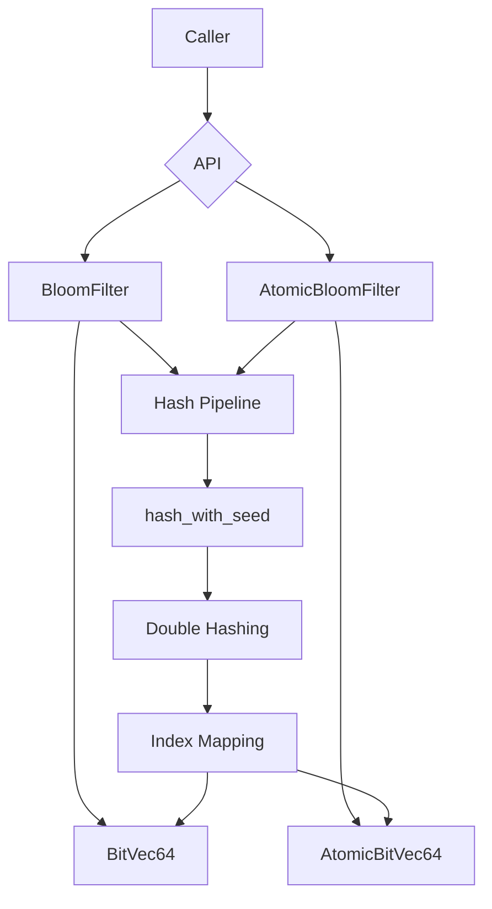
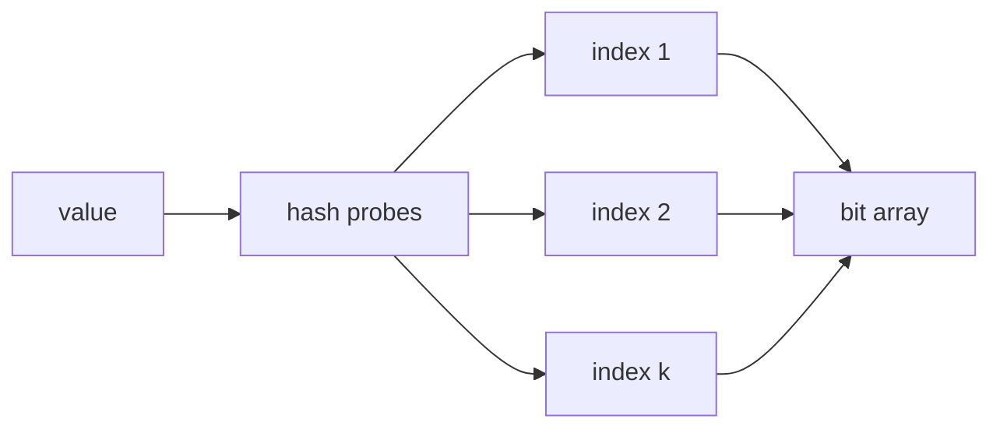
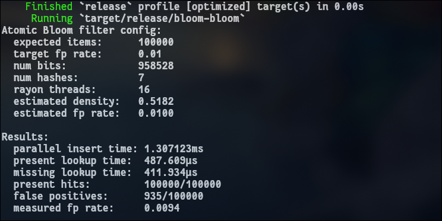

# Bloom Bloom

A compact, in-memory Bloom filter implementation in Rust.

Bloom Bloom is a focused probabilistic set-membership library. It answers one question quickly:

> has this value probably been inserted before?

The answer can be:

- definitely no, or
- probably yes.

That tradeoff is the core value of a Bloom filter. It uses a fixed-size bit array and multiple hash probes to provide memory-efficient membership checks with no false negatives for completed inserts, while allowing a configurable false-positive rate.

This repository currently implements:

- a packed `u64` bit vector,
- a mutable single-threaded `BloomFilter`,
- an atomic `AtomicBloomFilter` for concurrent inserts and reads,
- configurable bit count and hash count,
- sizing from expected item count and target false-positive rate,
- expected density estimation,
- expected false-positive-rate estimation,
- double hashing for efficient multi-probe lookup,
- fast modulo-free index mapping,
- generic insertion and lookup for any `T: Hash`,
- unit tests for core bit-vector and Bloom-filter behavior,
- a Rayon-powered demo binary for parallel insert and lookup measurement.

---

## Why This Exists

A normal set stores the actual values. That is exact, but it can become expensive when the only thing a system needs is a fast pre-check.

Bloom filters are useful when a cheap "probably present" answer can avoid a more expensive operation:

- checking whether a key might exist before hitting disk,
- reducing database or cache lookups,
- filtering duplicate work,
- pre-screening URLs, IDs, tokens, or events,
- building memory-efficient indexing layers,
- protecting slower exact data structures from unnecessary queries,
- quickly ruling out missing values in ingestion pipelines.

The important promise is asymmetric:

- if `contains(value)` returns `false`, the value was not inserted into the completed filter state,
- if it returns `true`, the value may have been inserted, or it may be a false positive.

That makes Bloom Bloom useful as a fast first line of defense. It is not a replacement for an exact set when exact membership is required.

---

## Architecture



The implementation is intentionally small. The public API is backed by two bit-vector implementations:

- `BitVec64`, a packed `Vec<u64>` used by `BloomFilter`,
- `AtomicBitVec64`, a `Vec<AtomicU64>` used by `AtomicBloomFilter`.

Both filters share the same hashing and probability helpers.

---

## Repository Layout

```text
src/
  lib.rs      # Bloom filter, bit vectors, hashing, probability helpers, tests
  main.rs     # Rayon demo for the atomic Bloom filter

Cargo.toml
Cargo.lock
```

The crate is currently compact enough that the library implementation lives in one file. That makes the behavior easy to inspect while the project is still small.

---

## Core Concepts

### Bloom filter behavior

A Bloom filter stores bits, not values.

When a value is inserted:

1. the value is hashed,
2. several bit positions are derived from those hashes,
3. every selected bit is set to `1`.

When a value is checked:

1. the same bit positions are derived,
2. if any selected bit is `0`, the value is definitely absent,
3. if all selected bits are `1`, the value is probably present.



The filter never stores the original value. That is why it is memory efficient, and also why it cannot list inserted values or remove values safely.

### False positives

False positives happen when a value that was never inserted maps to bit positions that were already set by other values.

Example:

```rust
let mut filter = bloom_bloom::BloomFilter::with_false_positive_rate(10_000, 0.01);

filter.insert("alice");

assert!(filter.contains("alice"));

if filter.contains("bob") {
    // "bob" might have been inserted, or this might be a false positive.
}
```

The false-positive rate rises as more values are inserted. The configured target is based on the expected item count; heavily exceeding that count makes the filter denser and less selective.

### No false negatives for completed inserts

After a value has been inserted into a non-racing filter state, a lookup for that value should return `true`.

Bloom filters do not unset bits during normal insertion, so an inserted value's required bits remain present.

The atomic filter supports concurrent access, but a lookup racing with an in-progress insert can observe only part of that insert. For strict "insert has happened before lookup" semantics between threads, use normal Rust synchronization around the operation boundary.

### Bit layout

`BitVec64` stores logical bits in `u64` words.

```text
logical bit index:  0 ... 63   64 ... 127   128 ... 191
storage word:       word 0      word 1        word 2
```

The mapping is:

```text
word_index = index / 64
bit_offset = index % 64
mask       = 1 << bit_offset
```

The implementation uses equivalent bit operations:

```rust
let word_index = index >> 6;
let bit_offset = index & 63;
```

This keeps bit storage compact and avoids allocating one byte or one bool per logical bit.

### Hash probes

Bloom Bloom derives multiple probe positions with double hashing.

The first two base hashes are computed by hashing a seed and the user value:

```rust
let h1 = hash_with_seed(value, 0);
let h2 = hash_with_seed(value, 1);
```

Additional probes are derived as:

```text
h_i = h1 + i * h2
```

using wrapping arithmetic.

This avoids running a completely independent hash function for every probe while still giving the filter multiple bit positions per value.

### Index mapping

Hash values are mapped into the bit-vector range with multiply-high reduction:

```rust
let product = hash as u128 * num_bits as u128;
let index = (product >> 64) as usize;
```

This maps a `u64` hash into `0..num_bits` without using `%`.

---

## Public API

The crate exposes two main filter types:

- `BloomFilter`, for single-threaded or externally synchronized use,
- `AtomicBloomFilter`, for shared concurrent inserts and lookups.

It also exposes helper functions for sizing and probability estimates:

- `optimal_num_bits`,
- `optimal_num_hashes`,
- `expected_density`,
- `expected_false_positive_rate`.

### Single-threaded filter

Use `BloomFilter` when you have mutable access to the filter.

```rust
use bloom_bloom::BloomFilter;

fn main() {
    let mut filter = BloomFilter::with_num_bits(1024, 3);

    let was_probably_present = filter.insert("hello");
    assert!(!was_probably_present);

    assert!(filter.contains("hello"));
    assert!(!filter.contains("goodbye"));
}
```

`insert` returns whether all of the value's bits were already set before this call. In practice, that means:

- `false`: at least one bit changed, so this value was definitely new to the filter state,
- `true`: all bits were already set, so this value was probably already present.

Because Bloom filters allow collisions, `true` is still probabilistic.

### Size by false-positive rate

For most use cases, construct the filter from an expected item count and target false-positive rate.

```rust
use bloom_bloom::BloomFilter;

fn main() {
    let expected_items = 100_000;
    let target_fp_rate = 0.01;

    let mut filter = BloomFilter::with_false_positive_rate(
        expected_items,
        target_fp_rate,
    );

    filter.insert(&42);

    println!("bits: {}", filter.num_bits());
    println!("hashes: {}", filter.num_hashes());
    println!(
        "expected fp rate: {:.4}",
        filter.expected_false_positive_rate(expected_items)
    );
}
```

The bit count is rounded up to a multiple of 64 so it fits cleanly into the packed `u64` storage.

### Atomic filter

Use `AtomicBloomFilter` when multiple threads need to insert or check values through a shared reference.

```rust
use bloom_bloom::AtomicBloomFilter;
use rayon::prelude::*;

fn main() {
    let filter = AtomicBloomFilter::with_false_positive_rate(100_000, 0.01);

    (0..100_000u64).into_par_iter().for_each(|value| {
        filter.insert(&value);
    });

    let hits = (0..100_000u64)
        .into_par_iter()
        .filter(|value| filter.contains(value))
        .count();

    assert_eq!(hits, 100_000);
}
```

Internally, each bit is set with an atomic `fetch_or` on the containing `u64` word. This makes concurrent bit-setting safe without a global mutex.

### Probability helpers

The helper functions expose the same math used by the constructors.

```rust
use bloom_bloom::{
    expected_density,
    expected_false_positive_rate,
    optimal_num_bits,
    optimal_num_hashes,
};

fn main() {
    let expected_items = 50_000;
    let target_fp_rate = 0.005;

    let bits = optimal_num_bits(expected_items, target_fp_rate);
    let hashes = optimal_num_hashes(bits, expected_items);

    let density = expected_density(bits, hashes, expected_items);
    let fp_rate = expected_false_positive_rate(bits, hashes, expected_items);

    println!("bits={bits}, hashes={hashes}");
    println!("density={density:.4}, fp_rate={fp_rate:.4}");
}
```

---

## Configuration

Bloom Bloom has two construction styles.

### Explicit sizing

```rust
let filter = BloomFilter::with_num_bits(1_048_576, 7);
let atomic = AtomicBloomFilter::with_num_bits(1_048_576, 7);
```

Use this when you already know the exact bit count and hash count you want.

Validation:

- `num_bits` must be greater than `0`,
- `num_hashes` must be greater than `0`.

### Probability-based sizing

```rust
let filter = BloomFilter::with_false_positive_rate(100_000, 0.01);
let atomic = AtomicBloomFilter::with_false_positive_rate(100_000, 0.01);
```

Use this when you know the expected number of inserted items and the target false-positive rate.

Validation:

- `expected_items` must be greater than `0`,
- `false_positive_rate` must be greater than `0.0`,
- `false_positive_rate` must be less than `1.0`.

The optimal bit count is computed as:

```text
m = -(n * ln(p)) / (ln(2)^2)
```

The optimal hash count is computed as:

```text
k = (m / n) * ln(2)
```

Where:

- `n` is the expected item count,
- `p` is the target false-positive rate,
- `m` is the number of bits,
- `k` is the number of hash probes.

---

## Running the Project

Run tests:

```bash
cargo test
```

Run the parallel demo:

```bash
cargo run --release
```

The demo creates an `AtomicBloomFilter`, inserts `100_000` integers in parallel with Rayon, checks all inserted values, checks another range of missing values, and prints the measured false-positive rate.



Exact timings and false-positive counts vary by machine, thread count, compiler settings, and hash distribution.

---

## Test Coverage

The current unit tests cover:

| Test | Focus |
|---|---|
| `new_bitvec_starts_empty` | new bit vectors start with all bits unset |
| `set_marks_a_bit` | setting a bit makes it observable |
| `set_returns_whether_bit_was_already_set` | bit setting reports previous state |
| `bits_cross_word_boundaries` | indexes across `u64` word boundaries work |
| `empty_bloom_filter_contains_nothing` | empty filters reject sample values |
| `inserted_value_is_contained` | inserted values are found |
| `many_inserted_values_are_contained` | many inserted values remain findable |
| `insert_reports_whether_all_bits_were_already_set` | insert reports probable prior presence |

Run the full suite with:

```bash
cargo test
```

---

## Performance Notes

The implementation is built around a few simple performance choices:

- bits are packed into `u64` words,
- index mapping avoids modulo,
- multiple probes are derived through double hashing,
- atomic inserts update a single word at a time with `fetch_or`,
- the demo uses Rayon to exercise concurrent insertion and lookup.

The main cost per operation is:

```text
hashing + k bit probes
```

Where `k` is the number of hash functions configured for the filter.

Increasing `num_hashes` can reduce false positives up to the optimal point, but it also increases CPU work for both insertion and lookup. Increasing `num_bits` reduces density and false positives, but uses more memory.

---

## Correctness Boundaries

Bloom Bloom has a deliberately narrow contract.

### What it guarantees

- inserted values are represented by setting all of their probe bits,
- completed single-threaded inserts are observable by later single-threaded lookups,
- atomic bit updates are data-race free,
- `contains` never returns `true` because values are stored directly; it only checks bits,
- helper functions follow standard Bloom-filter sizing formulas.


---

## Example Use Cases

### Cache pre-check

```rust
use bloom_bloom::BloomFilter;

struct CacheIndex {
    might_exist: BloomFilter,
}

impl CacheIndex {
    fn new() -> Self {
        Self {
            might_exist: BloomFilter::with_false_positive_rate(1_000_000, 0.01),
        }
    }

    fn remember_key(&mut self, key: &str) {
        self.might_exist.insert(key);
    }

    fn should_check_cache(&self, key: &str) -> bool {
        self.might_exist.contains(key)
    }
}
```

If `should_check_cache` returns `false`, the cache lookup can be skipped. If it returns `true`, the exact cache still needs to be checked.

### Duplicate work filter

```rust
use bloom_bloom::BloomFilter;

fn main() {
    let mut seen = BloomFilter::with_false_positive_rate(10_000, 0.01);

    for job_id in ["a", "b", "a", "c"] {
        if seen.insert(job_id) {
            println!("probably seen before: {job_id}");
        } else {
            println!("first time according to filter: {job_id}");
        }
    }
}
```

This is useful when occasional false positives are acceptable. If skipping a new job would be harmful, use an exact set instead.

---

## Development Commands

Format the code:

```bash
cargo fmt
```

Run tests:

```bash
cargo test
```

Run the release demo:

```bash
cargo run --release
```

Check the crate without running tests:

```bash
cargo check
```

---

## Summary

Bloom Bloom is a compact Rust implementation of a classic Bloom filter:

- memory-efficient bit storage,
- generic hashed values,
- configurable accuracy and capacity,
- single-threaded and atomic APIs,
- simple probability helpers,
- parallel demo workload,
- focused tests.

It is best used as a fast probabilistic pre-check in front of more expensive exact systems. It answers "definitely not" cheaply and "probably yes" with bounded, configurable uncertainty.
